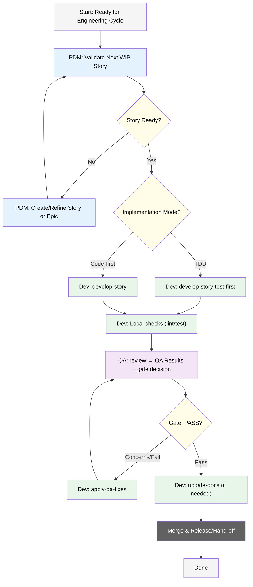

# IDE Development Workflow

## 1. Introduction

Once the strategic planning phase concludes, the engineering cycle commences within the Integrated Development Environment (IDE). This document provides a formal guide to the development workflow, detailing the structured process, the distinct roles of each engineering agent, and the standards for execution. The objective is to ensure a predictable, high-quality, and efficient path from a validated story to a merged, production-ready feature.

## 2. Agent Roles and Responsibilities

The engineering workflow is executed by a team of three specialized agents, each with a clearly defined mandate:

*   **PDM (Product Development Master):** The PDM acts as the gatekeeper for the development pipeline. This agent is responsible for backlog management, ensuring that every story is properly scoped, validated against checklists, and ready for implementation before being assigned to a developer.
*   **Dev (Full Stack Developer):** The Dev agent is the core implementer, responsible for writing, testing, and documenting the code required to complete a story. This agent operates with a strict focus on the technical execution and adherence to predefined quality standards.
*   **QA (Test Architect & Quality Advisor):** The QA agent serves as the independent quality authority. It performs comprehensive, risk-aware reviews of completed work, provides an explicit gate decision (Pass, Concerns, or Fail), and designs robust test strategies to ensure system integrity.

## 3. The Development Lifecycle

The development process follows a structured lifecycle, visualized in the flow graph below. Each phase is designed to ensure alignment, quality, and efficient handoffs.

### Phase 1: Story Validation and Kickoff

The cycle begins with the **PDM** agent.

1.  **Validate Next Story:** The PDM assesses the highest-priority story in the backlog, verifying it is in a 'WIP' (Work-In-Progress) state and meets all readiness criteria defined in the `story-checklist`.
2.  **Scope Refinement:** If the story is not ready or if scope gaps are identified, the PDM initiates a clarification loop, using commands like `*create-story` or `*create-epic` to refine the requirements. The process does not proceed until a story is fully validated.

### Phase 2: Implementation

Once a story is validated, the **Dev** agent takes over.

1.  **Select Implementation Strategy:** The developer chooses one of two implementation modes:
    *   **Test-Driven Development (TDD):** Invoke `*develop-story-test-first` to write failing tests based on the story's acceptance criteria *before* writing the implementation code.
    *   **Implementation-First:** Invoke `*develop-story` to write the feature code first, followed by corresponding tests.
2.  **Local Quality Checks:** Before handing off to QA, the Dev agent runs local validation, including linting and unit tests, to ensure adherence to project standards.

### Phase 3: Quality Assurance

Upon completion of local checks, the work is handed to the **QA** agent for formal review.

1.  **Comprehensive Review:** The QA agent executes the `*review` command. This triggers an adaptive, risk-based assessment of the implemented code against the story's requirements.
2.  **Gate Decision:** The review concludes with two critical artifacts: an updated **QA Results** section in the story file and a formal **gate decision** (`PASS`, `CONCERNS`, or `FAIL`).
3.  **Feedback Loop:** If the gate decision is `CONCERNS` or `FAIL`, the story is returned to the Dev agent, who uses the `*apply-qa-fixes` command to address the identified issues. The story then re-enters the QA review phase.

### Phase 4: Finalization and Merge

After a story successfully passes the QA gate, the **Dev** agent performs final closing tasks.

1.  **Documentation Update:** If the changes affect APIs or component behavior, the Dev agent runs `*update-docs` to ensure all relevant documentation is synchronized with the new code.
2.  **Merge and Handoff:** The completed story is merged into the main branch, and the process concludes with a handoff for release or deployment.

## 4. Development Flow Graph

## 5. Workflow Principles

*   **Status Integrity:** Maintain accurate story statuses (e.g., 'WIP', 'In Review') to ensure the workflow functions correctly.
*   **Living Documentation:** If planning artifacts (PRD, Architecture) must evolve during development, ensure these changes are formally documented and reviewed.
*   **Reference:** For details on how the engineering cycle is prepared, see `docs/planning-workflow.md`.
