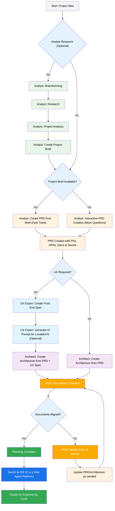

# Planning Workflow

This guide outlines the planning workflow essential to spec-driven development. Effective planning establishes parameters and objectives for agent execution and will precede (almost) all implementation activity.

## Scopes and Rationale

Planning is the entry point for (almost) all software development activities. Matt Maher has made an excellent [video](https://www.youtube.com/watch?v=dBWnH0YA6tg&list=LL), perfectly explaining and demonstrating why comprehensive planning is necessary for predictable, reliable agent performance.

That said, in the context of AI-driven development, planning typically represents the most token-intensive phase. And accordingly, distinct planning methods and optimization strategies are employed at different context scopes to ensure efficiency.

### Project Brief

The Project Brief is the initial high-level document that captures the core idea, goals, and scope of the project. It serves as the precursor to the PRD, consolidating research, brainstorming, and analysis into a concise summary.

The `analyst` agent is responsible for creating the Project Brief. As shown in the Flow Graph, this typically happens after an optional research and brainstorming phase where the agent explores the project domain.

The Project Brief typically includes:

- **Project Overview:** A summary of what the project is and why it is being built.
- **Target Audience:** Who the users are and what problems the project solves for them.
- **Key Features:** A high-level list of desired functionality and capabilities.
- **Success Metrics:** How the success of the project will be measured.

This document allows for a "Fast-Track" creation of the PRD, providing the `analyst` with sufficient context to generate detailed requirements without starting from scratch.

### PRD

The Product Requirements Document (PRD) is the authoritative source of truth for the project, defining its purpose, features, and functionality. It serves as the primary input for both Architecture and UI/UX design phases, and provides the foundational context for engineering agents during implementation.

The `analyst` agent is responsible for creating the PRD and can do so in three ways, as illustrated in the Flow Graph.

1. **Fast-Track Creation (with Project Brief):** If a Project Brief is available, the `analyst` agent can be invoked with the `create-prd` command to generate the PRD directly from the brief. This is the most efficient method, as it leverages pre-existing research and analysis.

2. **Document Existing Project:** For existing codebases, use the `document-project` command to analyze project artifacts (README, package.json, code, docs) and create a comprehensive PRD from the current state.

3. **Interactive Creation (without Project Brief):** In the absence of a Project Brief or existing project, the `analyst` agent will engage in an interactive session to gather the necessary information. The agent will ask a series of questions to elicit the project's goals, user stories, functional and non-functional requirements. This process is more time-intensive, but ensures a comprehensive and well-defined PRD.

In all scenarios, the final output is a complete PRD that includes:

- **Functional Requirements (FRs):** The specific behaviors and capabilities of the system.
- **Non-Functional Requirements (NFRs):** The quality attributes of the system, such as performance, security, and usability.
- **Epics and Stories:** A hierarchical breakdown of the work to be done.

**Migration Note:** If you have multiple PRD files (prd-1-_.md, prd-2-_.md, etc.), consolidate them into a single `docs/prd.md` file. Merge requirements, epics, and stories chronologically, preserving the most recent versions and creating a unified Change Log.

### Architecture

The Architecture document outlines the technical blueprint of the project, detailing the system's structure, components, and their interactions. It is a critical document that translates the functional and non-functional requirements from the PRD into a concrete technical design.

The `architect` agent is responsible for creating the Architecture document. As shown in the Flow Graph, the `architect` agent can be invoked after the PRD has been created. The agent will use the PRD as its primary input and will generate an architecture that satisfies all the requirements outlined in the PRD.

The Architecture document typically includes:

- **System Overview:** A high-level description of the system's components and their relationships.
- **Component Design:** Detailed design of each component, including its responsibilities and interfaces.
- **Data Model:** The structure of the data that the system will manage.
- **Technology Stack:** The technologies that will be used to build the system.

### UI/UX

The UI/UX specification defines the user interface and experience for the project. This document is essential for projects with a user-facing component, as it translates the product requirements into a tangible design that can be implemented by the engineering team.

The `ux-expert` agent is responsible for creating the UI/UX specification. As depicted in the Flow Graph, the `ux-expert` is invoked when a project requires a user interface. The agent can perform two primary functions:

1. **Create Frontend Specification:** Using the `create-frontend-spec` command, the `ux-expert` generates a comprehensive frontend specification. This document outlines user flows, wireframes, and component designs necessary to build the user interface.
2. **Generate AI UI Prompt:** With the `generate-ui-prompt` command, the `ux-expert` can create a prompt for an AI-powered UI generation tool. This is an optional step that can accelerate the design process by providing a starting point for visual design.

The UI/UX specification serves as a critical input for the `architect` agent, ensuring that the system architecture can support the required user interface and experience.

### Flow Graph

